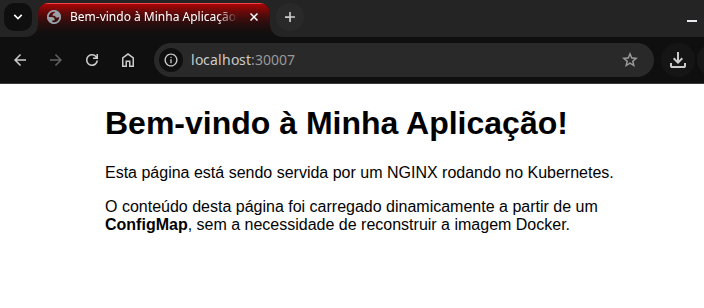

# 03 - Estudo: ConfigMaps e Secrets

Este laboratório demonstra como desacoplar dados de configuração e dados sensíveis de uma imagem de contêiner.

### Objetivo
- Usar um `ConfigMap` para fornecer um arquivo de configuração (`index.html`) a um Pod NGINX.
- Usar um `Secret` para injetar dados sensíveis (usuário/senha) como variáveis de ambiente em um contêiner.

### Passos para Execução e Verificação

1.  **Criar o `ConfigMap`** com o conteúdo da nossa página HTML customizada:
    ```bash
    kubectl apply -f configmap.yaml
    ```
2.  **Criar o `Secret`** com dados fictícios de usuário e senha. O Kubernetes codifica os valores em base64 automaticamente com este comando:
    ```bash
    kubectl create secret generic meu-app-secret --from-literal=USUARIO=admin --from-literal=SENHA=SenhaSuperSecreta123
    ```
3.  **Aplicar o `Deployment` modificado**, que agora usa o `ConfigMap` e o `Secret`:
    ```bash
    kubectl apply -f deployment.yaml
    ```
4.  **Aplicar o `Service`** do laboratório anterior para expor a aplicação:
    ```bash
    kubectl apply -f ../02-services/service.yaml
    ```
5.  **Verificar o `ConfigMap` (Visualmente)**:
    - Acesse **http://localhost:30007** no seu navegador. Você deve ver a nova página HTML customizada.

<p align="center"></p>

6.  **Verificar o `Secret` (Via Terminal)**:
    - Pegue o nome de um dos seus pods: `kubectl get pods`
    - Acesse um shell dentro do contêiner:
      ```bash
      kubectl exec -it <NOME_DO_POD> -- /bin/bash
      ```
    - Dentro do contêiner, verifique as variáveis de ambiente:
      ```bash
      printenv | grep USUARIO
      printenv | grep SENHA
      ```
    - Você verá as variáveis `USUARIO` e `SENHA` com os valores que definimos. Saia do contêiner com o comando `exit`.

### Limpeza do Ambiente
```bash
kubectl delete deployment meu-app-nginx
kubectl delete service meu-app-nginx-service
kubectl delete configmap pagina-nginx-configmap
kubectl delete secret meu-app-secret