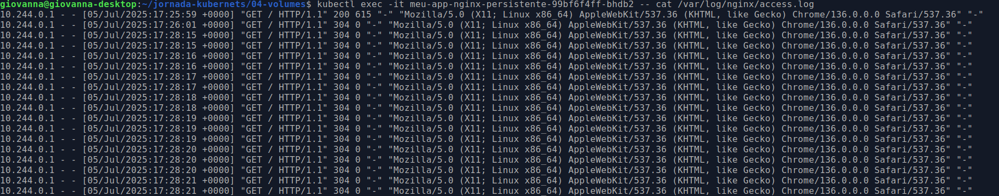

# 04 - Estudo: Volumes e Persistência de Dados

Este laboratório demonstra como usar Volumes para persistir dados além do ciclo de vida de um Pod.

### Objetivo

  - Entender por que o sistema de arquivos de um contêiner é efêmero.
  - Implementar um volume do tipo `hostPath` para armazenar dados em um diretório no nó do cluster.
  - Provar que os dados (logs do NGINX) sobrevivem mesmo quando um Pod é deletado e recriado pelo `Deployment`.

### Passos para Execução e Verificação

1.  **Aplicar o `Deployment`** que está configurado para usar o volume `hostPath`:

    ```bash
    kubectl apply -f deployment.yaml
    ```

2.  **Expor a aplicação** usando o `Service` do laboratório 02. Vamos criar um novo para não ter conflito de labels. Crie um arquivo `service.yaml` com o conteúdo abaixo e aplique:

    ```yaml
    # service.yaml
    apiVersion: v1
    kind: Service
    metadata:
      name: meu-app-nginx-persistente-service
    spec:
      type: NodePort
      selector:
        # ATENÇÃO: O seletor deve corresponder ao label do novo deployment
        app: meu-app-persistente
      ports:
      - port: 80
        targetPort: 80
        nodePort: 30007
    ```

    ```bash
    kubectl apply -f service.yaml
    ```

3.  **Gerar Logs**: Acesse **http://localhost:30007** algumas vezes no seu navegador para gerar entradas no arquivo `access.log` do NGINX.

4.  **Verificar os Logs (1ª vez)**:

      - Pegue o nome do seu pod: `kubectl get pods`
      - Entre no pod e leia o conteúdo do arquivo de log:

    <!-- end list -->

    ```bash
    kubectl exec -it <NOME_DO_POD> -- cat /var/log/nginx/access.log
    ```

      - Você verá os registros dos seus acessos. Saia do Pod com `exit`.

5.  **Simular uma Falha**: Vamos deletar o Pod manualmente. O `Deployment` irá criar um novo automaticamente.

    ```bash
    kubectl delete pod <NOME_DO_POD>
    ```

6.  **Verificar os Logs (2ª vez)**:

      - Espere o novo Pod ser criado. Verifique com `kubectl get pods` até que ele esteja `Running`.
      - Pegue o nome do **novo** Pod.
      - Entre no novo Pod e verifique o arquivo de log novamente:

    <!-- end list -->

    ```bash
    kubectl exec -it <NOME_DO_NOVO_POD> -- cat /var/log/nginx/access.log
    ```

      - **Resultado**: Você verá que os logs antigos ainda estão lá\! Isso prova que os dados persistiram no diretório `/mnt/logs` do nó e foram "reatachados" ao novo Pod.

-----

### Resultados Visuais da Verificação

Abaixo estão os prints que comprovam o ciclo de teste da persistência dos dados.

**1. Geração dos Dados**

Acessando a aplicação no navegador para gerar as entradas de log.
<p align="center"></p>

**2. Verificação no Pod Original**

O terminal mostrando os logs escritos com sucesso dentro do primeiro Pod.
<p align="center"></p>

**3. Simulação da Falha**

O terminal mostrando o comando de deleção do Pod e o Kubernetes criando um novo para substituí-lo.
<p align="center"></p>

**4. Prova da Persistência**

O terminal mostrando que os mesmos logs originais estão presentes no novo Pod, confirmando o funcionamento do Volume.
<p align="center"></p>

-----

### Limpeza do Ambiente

```bash
kubectl delete deployment meu-app-nginx-persistente
kubectl delete service meu-app-nginx-persistente-service
```