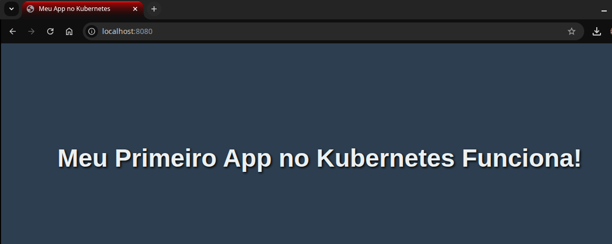

# Jornada Kubernetes

Repositório dedicado à documentação da minha jornada de estudos e experimentos práticos com Kubernetes, desde a configuração do ambiente até a orquestração de aplicações complexas.

---

### **Objetivo**

O propósito deste repositório é consolidar o aprendizado, criar uma base de conhecimento consultável e demonstrar de forma prática as competências adquiridas no ecossistema de contêineres e orquestração.

---

### **Tecnologias Utilizadas**

* **Orquestração:** Kubernetes (K8s)
* **Conteinerização:** Docker
* **Cluster Local:** Kind (Kubernetes in Docker)
* **CLI:** kubectl, Docker CLI
* **Infraestrutura como Código (IaC):** Arquivos de manifesto YAML

---

### **Estrutura do Repositório**

Cada estudo ou laboratório prático está contido em sua própria pasta numerada, contendo os arquivos YAML e um `README.md` específico com os detalhes daquele experimento.

---

### **Laboratórios e Estudos Realizados**

* **[00 - Preparação do Ambiente](./00-preparacao-ambiente/README.md)**: Guia passo a passo para configurar o ambiente de desenvolvimento local com Docker, Kind e kubectl.
* **[01 - Ciclo de Vida do Deployment](./01-deployment-lifecycle/README.md)**: Estudo sobre criação, escalabilidade e atualização (Rolling Update) de uma aplicação NGINX.

---

### **Como Replicar o Ambiente**

As instruções detalhadas para configurar o ambiente do zero estão no documento [Preparação do Ambiente](./00-preparacao-ambiente/README.md).

---

### **Autor**

* **Giovanna Freitas**
* **GitHub:** [oig04](https://github.com/oig04)
* **LinkedIn:** [giovannafreitasdev](https://www.linkedin.com/in/giovannafreitasdev)

---

### 📄 **Licença**

Este projeto está sob a licença MIT. Veja o arquivo [LICENSE](LICENSE) para mais detalhes.